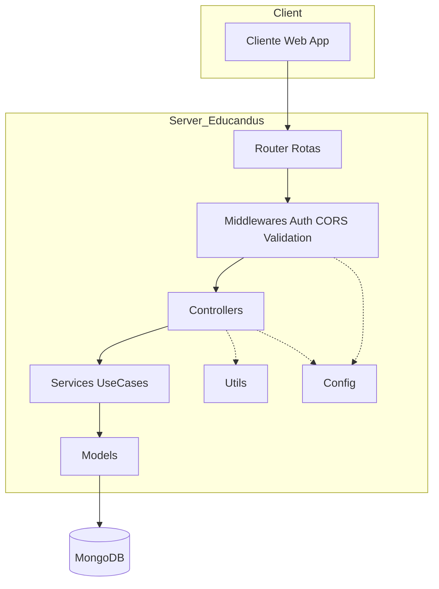
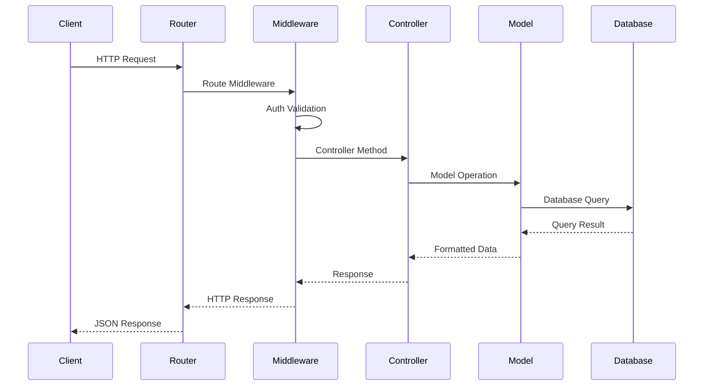
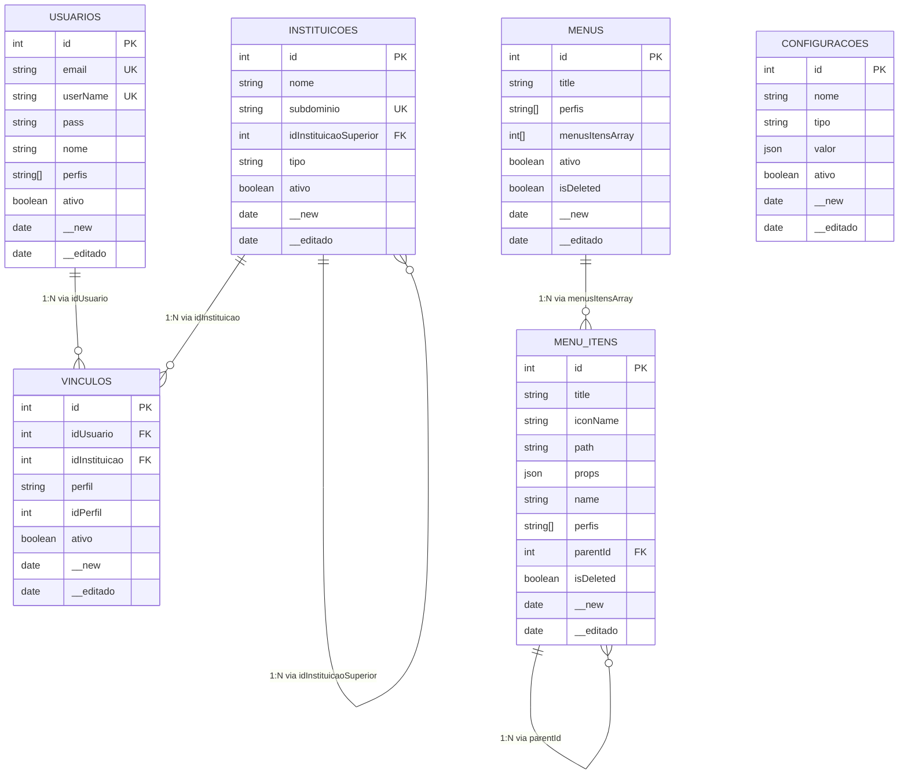
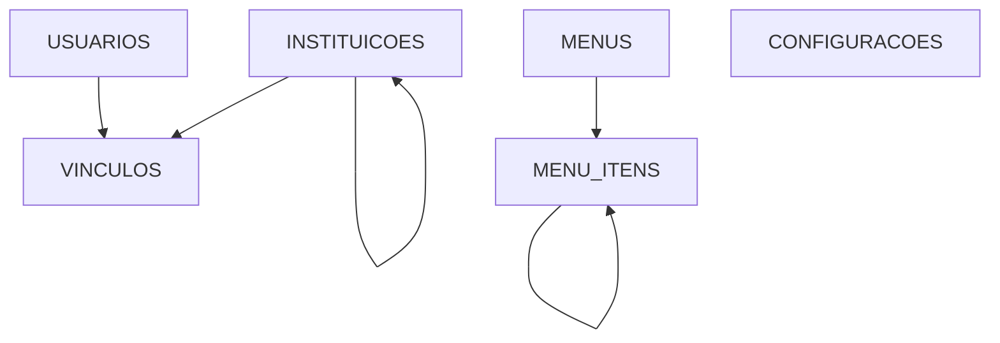

# 📚 Documentação Técnica - Educandus Backend

## 🎯 Visão Geral Técnica

Este documento contém informações técnicas detalhadas sobre a arquitetura, padrões de código e especificações do backend do **Educandus**.

---

## 🏗️ Arquitetura Detalhada

### Padrão MVC (revisado)



---

### Fluxo de Requisição



---

## 📊 Modelo de Dados

### Coleções (MongoDB)

#### `usuarios`
```javascript
{
  id: Number,           // PK - Identificador único
  email: String,        // UK - Email único
  userName: String,     // UK - Nome de usuário único
  pass: String,         // Hash da senha (bcrypt)
  nome: String,         // Nome completo
  perfis: Array,         // Array de perfis/permissões
  ativo: Boolean,       // Status ativo/inativo
  __new: Date,          // Data de criação
  __editado: Date       // Data de última edição
}
```

#### `instituicoes`
```javascript
{
  id: Number,                    // PK - Identificador único
  nome: String,                  // Nome da instituição
  subdominio: String,            // UK - Subdomínio único
  idInstituicaoSuperior: Number, // FK - ID da instituição pai
  tipo: String,                  // Tipo da instituição
  ativo: Boolean,                // Status ativo/inativo
  __new: Date,                   // Data de criação
  __editado: Date                // Data de última edição
}
```

#### `menus`
```javascript
{
  id: Number,              // PK - Identificador único
  title: String,           // Título do menu
  perfis: Array,            // Perfis que podem acessar
  menusItensArray: Array,  // Array de itens do menu (IDs de menuItens)
  ativo: Boolean,          // Status ativo/inativo
  isDeleted: Boolean,      // Soft delete
  __new: Date,             // Data de criação
  __editado: Date          // Data de última edição
}
```

#### `menuItens`
```javascript
{
  id: Number,        // PK - Identificador único
  title: String,     // Título do item
  iconName: String,  // Nome do ícone
  path: String,      // Caminho/rota
  props: Object,     // Propriedades adicionais
  name: String,      // Nome do componente
  perfis: Array,      // Perfis que podem acessar
  parentId: Number,  // FK - ID do item pai (auto-relacionamento)
  isDeleted: Boolean, // Soft delete
  __new: Date,       // Data de criação
  __editado: Date    // Data de última edição
}
```

#### `vinculos`
```javascript
{
  id: Number,           // PK - Identificador único
  idUsuario: Number,    // FK - ID do usuário
  idInstituicao: Number, // FK - ID da instituição
  perfil: String,        // Perfil do usuário
  idPerfil: Number,     // ID do perfil
  ativo: Boolean,       // Status ativo/inativo
  __new: Date,          // Data de criação
  __editado: Date       // Data de última edição
}
```

#### `configuracoes`
```javascript
{
  id: Number,      // PK - Identificador único
  nome: String,    // Nome da configuração
  tipo: String,    // Tipo da configuração
  valor: Object,   // Valor da configuração
  ativo: Boolean,  // Status ativo/inativo
  __new: Date,     // Data de criação
  __editado: Date  // Data de última edição
}
```

---

## 🔗 Relacionamentos

### Diagrama ER (simplificado)



### Diagrama de Relacionamentos (simples)



---

## 🔐 Autenticação e Segurança

- Autenticação via **JWT** usando **Passport.js**.
- Extração do token: **Authorization Bearer** ou cookie `token`.
- Secret do JWT lido de **`process.env.JWT_SECRET`** em `auth.js` (`jwtOptions.secretOrKey`).
- Expiração do token nas rotas de login: **7 dias**.

**Endpoints principais de auth:**
- `POST /auth/login` – Gera cookie HttpOnly com JWT
- `GET /auth/me` – Retorna dados do usuário autenticado
- `POST /auth/logout` – Limpa cookie `token`
- `PUT /auth/password` – Atualiza senha (JWT requerido)
- `POST /auth/login/conteudo` – Fluxo alternativo de login com retorno de `to
**Admin Logs (auditoria):**
- Middleware global registra ações administrativas na coleção `admin_log`.
- Log padrão: **CREATE/UPDATE/DELETE** (e GETs se `logGets` estiver habilitado), com `entity`, `endpoint`, `statusCode`, `ip`, `userAgent` e *snapshot* da requisição.
- Eventos de **LOGIN/LOGOUT** podem ser registrados em `admin_log` se o *helper* de auth estiver integrado.
ken` e `menu` por perfil

---

## 📡 Entidades e Endpoints

- **Users**: `/users` (CRUD, admin)
- **Instituições**: `/instituicoes` (listagem protegida por JWT, mutação admin)
- **Menus**: `/menus` (CRUD, admin)
- **Menu Itens**: `/menu-itens` (CRUD, admin)
- **Vínculos**: `/vinculos` (listagem protegida por JWT, mutação admin)
- **Configurações**: `/configs`, `/configs/menu/colors`, `/configs/perfis` (admin)
- **Perfils**: `/perfis`, `/perfis/list` (admin)
- **Health**: `/health/db`

---

## ⚙️ Variáveis de Ambiente e Execução

- Porta padrão: `50010` (ver `bin/www` e `Dockerfile`)
- CORS: definido diretamente em `app.js`

**Scripts úteis**
- `npm run start:dev` – `npx nodemon ./bin/www`
- `npm start` – `nodemon init-and-start.js`
- `npm run init` – roda `init-and-start.js` (cria admin, users, configs e itens de menu e sobe o server)
- `npm run setup` – cria admin e configs
- `npm run create-menu` – cria itens de menu padrão

---

## 🐳 Docker

- `Dockerfile` expõe `50010` e roda `npm start`.
- `docker-compose` inclui serviços `mongodb` e `backend` na porta `50010`.

---

**Documentação Técnica v1.4 - Educandus Backend**

